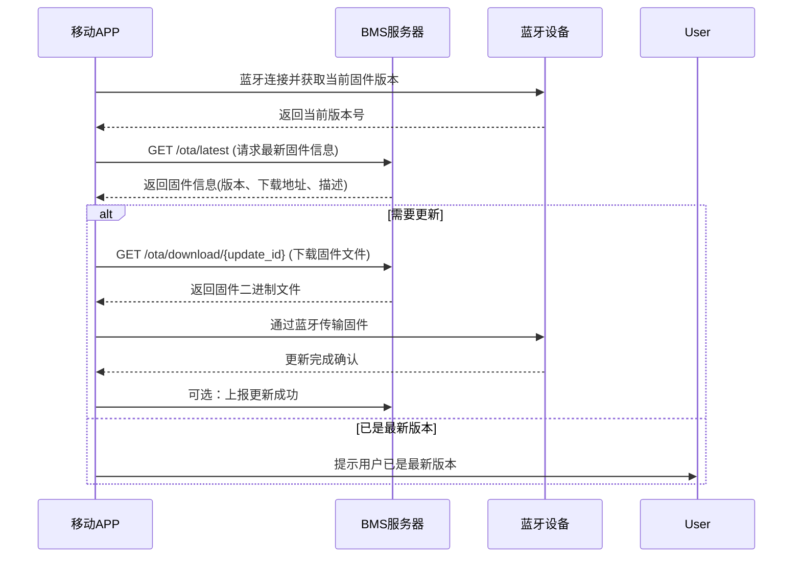

# BMS 客户端应用开发指南

## HTTP vs TCP 选择建议

对于您描述的通过蓝牙连接固件，然后APP向服务端请求最新固件，再通过蓝牙更新的场景，**强烈推荐使用HTTP**而不是TCP，原因如下：

### HTTP的优势：

1. **实现简单** - 几乎所有移动平台（iOS、Android）都有成熟的HTTP客户端库
2. **无需维护连接** - 适合间歇性通信的移动应用场景
3. **兼容性好** - 可轻松穿过防火墙和代理服务器
4. **支持断点续传** - 对于固件文件传输非常重要
5. **内置缓存机制** - 可优化重复下载
6. **安全扩展** - 可通过HTTPS轻松加密传输

### TCP的劣势：

1. **实现复杂** - 需要管理连接状态、处理重连等
2. **资源消耗大** - 长连接会消耗更多电量和网络资源
3. **穿透困难** - 可能被防火墙阻止，需要额外的穿透技术

## 客户端实现流程

### 1. 检查固件更新流程



### 2. API请求实现

#### 2.1 获取最新固件信息

**请求：**
```http
GET http://服务器地址:8000/ota/latest
```

**响应示例：**
```json
{
  "id": 3,
  "version": "1.1.0",
  "filename": "1.1.0.bin",
  "description": "修复电池电量显示问题，优化充电算法",
  "release_date": "2023-12-01T10:00:00",
  "download_url": "/ota/download/3"
}
```

#### 2.2 下载固件文件

**请求：**
```http
GET http://服务器地址:8000/ota/download/3
```

**客户端处理：**
- 接收二进制文件响应
- 保存到临时目录
- 准备通过蓝牙发送到设备

### 3. 客户端代码示例

#### Android (Kotlin) 示例：

```kotlin
// 检查最新固件
val retrofit = Retrofit.Builder()
    .baseUrl("http://服务器地址:8000/")
    .addConverterFactory(GsonConverterFactory.create())
    .build()

val apiService = retrofit.create(BmsApiService::class.java)

lifecycleScope.launch(Dispatchers.IO) {
    try {
        val latestFirmware = apiService.getLatestFirmware()
        
        // 与设备当前版本比较
        val deviceVersion = getDeviceFirmwareVersionViaBluetooth()
        if (compareVersions(latestFirmware.version, deviceVersion) > 0) {
            // 下载固件文件
            val firmwareFile = downloadFirmwareFile(latestFirmware.downloadUrl)
            
            // 通过蓝牙更新设备
            updateDeviceFirmwareViaBluetooth(firmwareFile)
        }
    } catch (e: Exception) {
        Log.e("BMSUpdate", "更新失败: ${e.message}")
    }
}

// 下载固件文件
private suspend fun downloadFirmwareFile(downloadUrl: String): File {
    val call = apiService.downloadFirmware(downloadUrl)
    val response = call.execute()
    
    if (response.isSuccessful) {
        val file = File(context.cacheDir, "firmware_update.bin")
        response.body()?.byteStream()?.use { input ->
            file.outputStream().use { output ->
                input.copyTo(output)
            }
        }
        return file
    } else {
        throw IOException("下载失败: ${response.code()}")
    }
}
```

#### iOS (Swift) 示例：

```swift
// 检查最新固件
let session = URLSession.shared
let latestFirmwareURL = URL(string: "http://服务器地址:8000/ota/latest")!

session.dataTask(with: latestFirmwareURL) { data, response, error in
    guard let data = data, error == nil else {
        print("获取最新固件信息失败: \(error?.localizedDescription ?? "未知错误")")
        return
    }
    
    do {
        let firmwareInfo = try JSONDecoder().decode(FirmwareInfo.self, from: data)
        
        // 与设备当前版本比较
        self.getDeviceFirmwareVersion { deviceVersion in
            if self.compareVersions(firmwareInfo.version, deviceVersion) > 0 {
                // 下载固件文件
                self.downloadFirmwareFile(urlString: "http://服务器地址:8000\(firmwareInfo.downloadUrl)") {
                    fileURL in
                    // 通过蓝牙更新设备
                    self.updateDeviceFirmwareViaBluetooth(fileURL)
                }
            }
        }
    } catch {
        print("解析固件信息失败: \(error)")
    }
}.resume()

// 下载固件文件
func downloadFirmwareFile(urlString: String, completion: @escaping (URL) -> Void) {
    let url = URL(string: urlString)!
    let task = session.downloadTask(with: url) { temporaryURL, response, error in
        guard let temporaryURL = temporaryURL, error == nil else {
            print("下载固件失败: \(error?.localizedDescription ?? "未知错误")")
            return
        }
        
        let permanentURL = FileManager.default.temporaryDirectory
            .appendingPathComponent("firmware_update.bin")
        
        do {
            try FileManager.default.removeItemIfExists(at: permanentURL)
            try FileManager.default.moveItem(at: temporaryURL, to: permanentURL)
            DispatchQueue.main.async {
                completion(permanentURL)
            }
        } catch {
            print("保存固件文件失败: \(error)")
        }
    }
    task.resume()
}
```

## 蓝牙固件传输最佳实践

1. **分块传输** - 固件文件较大时，分块通过蓝牙发送
2. **校验机制** - 实现CRC或MD5校验确保传输完整性
3. **进度报告** - 向用户显示更新进度
4. **断点续传** - 支持从中断点继续传输
5. **超时处理** - 设置合理的蓝牙操作超时时间
6. **回滚机制** - 更新失败时能够恢复到原版本

## 版本比较算法

实现一个版本号比较函数，用于判断是否需要更新：

```kotlin
// Kotlin示例
fun compareVersions(version1: String, version2: String): Int {
    val parts1 = version1.split(".").map { it.toIntOrNull() ?: 0 }
    val parts2 = version2.split(".").map { it.toIntOrNull() ?: 0 }
    
    val maxLength = maxOf(parts1.size, parts2.size)
    
    for (i in 0 until maxLength) {
        val part1 = if (i < parts1.size) parts1[i] else 0
        val part2 = if (i < parts2.size) parts2[i] else 0
        
        if (part1 > part2) return 1
        if (part1 < part2) return -1
    }
    
    return 0 // 版本相同
}
```

```swift
// Swift示例
func compareVersions(_ version1: String, _ version2: String) -> Int {
    let parts1 = version1.split(separator: ".").map { Int($0) ?? 0 }
    let parts2 = version2.split(separator: ".").map { Int($0) ?? 0 }
    
    let maxLength = max(parts1.count, parts2.count)
    
    for i in 0..<maxLength {
        let part1 = i < parts1.count ? parts1[i] : 0
        let part2 = i < parts2.count ? parts2[i] : 0
        
        if part1 > part2 { return 1 }
        if part1 < part2 { return -1 }
    }
    
    return 0 // 版本相同
}
```

## 错误处理

实现全面的错误处理机制：

1. **网络错误** - 处理服务器连接失败、超时等情况
2. **蓝牙错误** - 处理蓝牙连接断开、传输失败等
3. **固件验证错误** - 确保下载的固件文件完整性
4. **用户中断** - 允许用户在适当时机取消更新

## 安全性考虑

1. **HTTPS加密** - 在生产环境中使用HTTPS保护传输
2. **固件签名验证** - 在设备端验证固件签名
3. **版本回滚保护** - 防止降级攻击
4. **访问控制** - 实现API认证机制

## 性能优化

1. **压缩固件文件** - 减小传输大小
2. **增量更新** - 只传输变化的部分（适用于大型固件）
3. **预下载** - 在WiFi环境下提前下载固件
4. **后台下载** - 支持应用在后台下载固件

---

通过遵循本指南，您可以实现一个可靠、高效的BMS设备固件更新机制，为用户提供良好的更新体验。